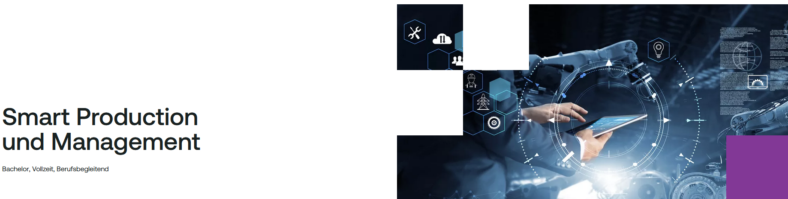

# Schulworkshop 2025

Hier finden Sie Unterlagen des Schulworkshops 2025 an der FH Steyr.

**📂 Präsentation:**

[Präsentation](#)

**🎥 Videos:**  
[▶️ Kanban VR Modell](Kanban_VR_Modell_compressed.mp4?raw=true)  
[▶️ Automotive Produktion Tesla](https://youtu.be/7-4yOx1CnXE)
[▶️ Automotive Produktion BMW](https://youtu.be/s6AS-YxT4g4)
[▶️ Zerspanende Fertigung 1](https://youtu.be/ACf3SqlZ0vQ)
[▶️ Zerspanende Fertigung 2](https://youtu.be/-kLlKQSibBY)
[▶️ 3D Printing 1](https://www.youtube.com/watch?v=_BFiXIO1rS8)
[▶️ 3D Printing 2](https://www.youtube.com/shorts/RCJkDLNW2_0)
[▶️ Spritzgießen](https://youtu.be/ACf3SqlZ0vQ?feature=shared)

**🧩 Simulationsmodell:**  
[📄 Schulmodell](schulmodell.apl?raw=true)

## 📬 Contact

Wolfgang Seiringer - [wolfgang.seiringer@fh-steyr.at](mailto:wolfgang.seiringer@fh-steyr.at)
